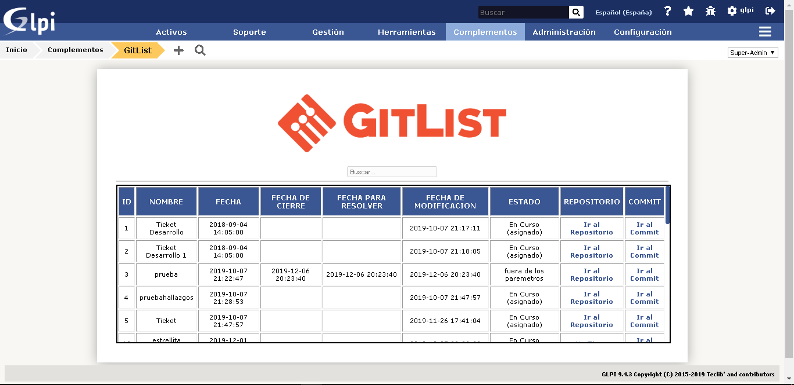

# Plugin Para Glpi

## Informacion
El plugin agrega una tabla a Glpi para poder ver los ticket enlazados con dichos Repositorios o Commits, dejando la posibilidad de ir directamente al commit o repositorio desde la tabla.

## Screenshots

