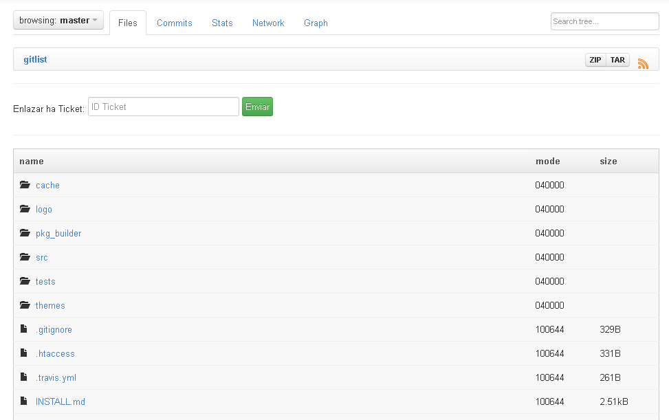

# Conexion con Glpi

## Informacion
La modificaciones hechas en el proyecto de [GitList](http://gitlist.org/) son con el fin de poderse enlazar un Ticket de [Glpi](https://glpi-project.org/) con dichos Repositorios.

## Archivos Modificados
Archivos mencionados a continuacion se encuentran en la direccion `themes/default/twig/`, en ambos archivos se creo un formulario de envio:

* `tree.twig`
* `commit.twig`

## Archivos Creados
Todos los archivos mencionados se encuentran en la carpeta `Conexion/`:

* `conexion.php`
* `config.php`
* `cerrar.php`
* `commit.php`
* `enviar.php`

## Screenshots

